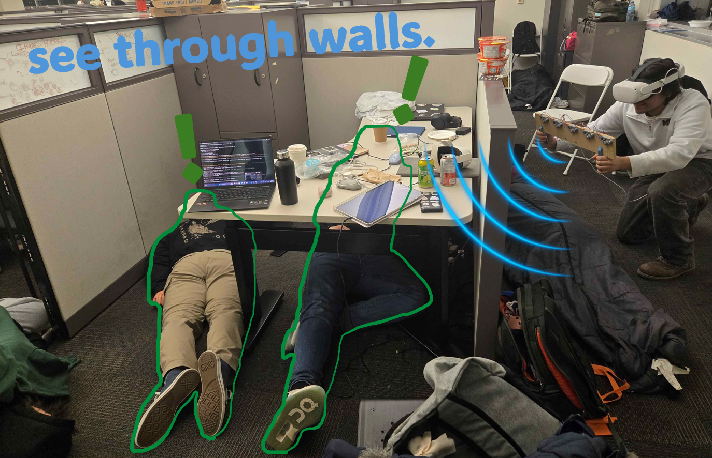
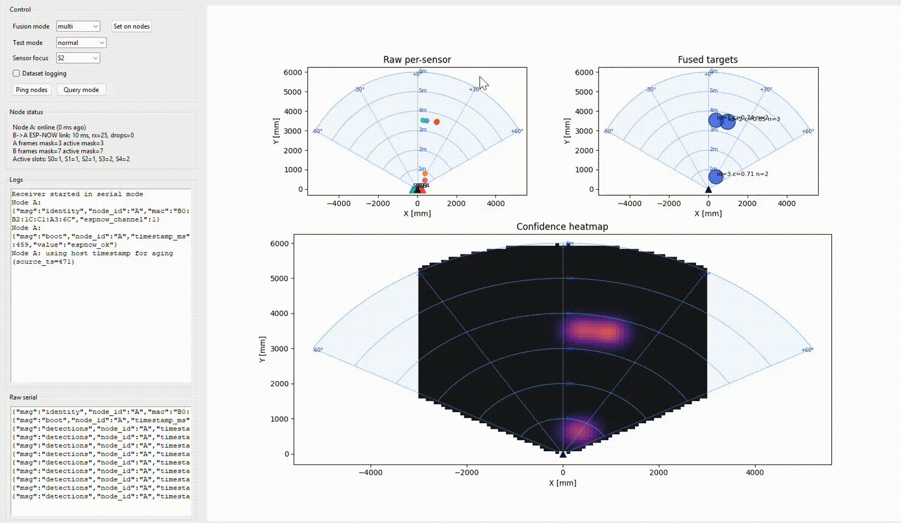
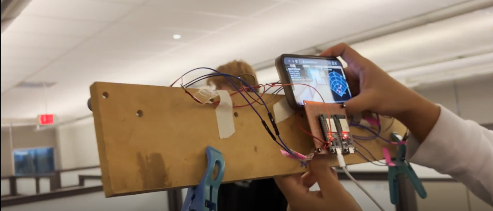
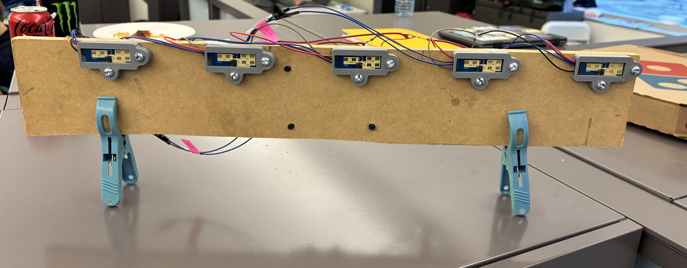

# wallhacks.

## what it does.

wallhacks is a handheld, multi-sensor mmwave system that detects people through non-metal obstacles and renders the results as live ar pings and a confidence radar heatmap.

- tracks multiple targets in real time with a fused 5-sensor array.
- shows ar pings at fused target positions in the headset view.
- overlays a top-right minimap-style confidence heatmap for situational awareness.
- supports a master/slave multi-headset mode where one headset carries the board and other headsets see aligned target pings relative to the master.
- filters near-origin interference and exposes rejected points as gray debug dots on the radar.

## core capabilities.

- through-wall human detection. ld2450-based radar targets are fused across five synchronized sensors for stronger tracking than a single module.
- sensor fusion and tracking. raw per-sensor detections are transformed into a shared bar frame, clustered, tracked over time, and confidence-scored.
- confidence heatmap. temporally smoothed gaussian occupancy map constrained by field-of-view and range.
- immersive ar and vr output. babylon.js webxr client renders pulse markers and radar ui in quest-compatible browser xr.
- multi-user shared spatial view. master/slave role registration plus headset pose relay keeps collaborators on the same tactical picture.
- networking for real deployments. tailscale funnel and serve replace ngrok for secure and practical cross-device access.

## tech spec.

### hardware.

- 5x hlk-ld2450 mmwave radar sensors on a horizontal bar.
- 2x esp32 nodes:
  - node a: usb host-facing gateway + local sensor ingestion.
  - node b: remote sensor ingestion + esp-now relay to node a.
- shared power rail and common ground across radar modules and mcus.

### firmware and transport.

- sensor telemetry emitted as compact json lines.
- node b to node a over esp-now.
- node a to host over usb serial (or optional udp path).
- host-side ingest supports auto serial port discovery.

### fusion and tracking pipeline.

- per-sensor local coordinates transformed to global bar coordinates.
- radius-based clustering of active detections.
- persistent track association over time.
- confidence scoring combines sensor agreement, temporal persistence, speed sanity, angle consistency, per-sensor weighting, and distance-resolution quality.
- heatmap generation uses gaussian accumulation, temporal smoothing, and a visibility mask bound to configured range and fov.
- near-range rejection gate removes close-in noise from fused targets and heatmap, while exposing those returns as debug dots.

### ar stack.

- frontend: html, css, javascript, babylon.js, webxr.
- backend: fastapi + websocket real-time stream.
- target rendering: confidence-scaled pulse markers, minimap radar with degree and range labels, cutoff ring, and debug rejects.
- headset alignment: master/slave relative transform using fixed offset calibration.

### networking and deployment.

- local backend on python.
- tailscale serve for tailnet-private access.
- tailscale funnel for public https access when needed.

## architecture.

ld2450 array -> esp32 nodes -> serial/udp ingest -> fusion engine -> websocket stream -> webxr clients
                                                               -> master/slave pose transform -> shared ar pings

## project structure.

- hardware/wyfyre_array_mvp/ - firmware, host tooling, calibration assets.
- AR_tailscale/ - single-client tailscale ar bridge.
- AR_tailscale_multi/ - master/slave multi-headset ar implementation.
- public/ - media assets for this project page.

## how to run.

### start backend.

1. cd AR_tailscale_multi
2. pip install -r requirements.txt
3. python server.py

### expose to headset.

1. tailscale funnel --bg 8000
2. tailscale funnel status
3. open the returned https url on quest browser.

### select roles.

- one device joins as master (board holder).
- all others join as slave.

## use cases.

- search and rescue in smoke or low-visibility spaces.
- tactical team awareness around occlusions.
- collaborative indoor sensing experiments and occupancy mapping.
- prototyping human-presence-aware spatial computing interfaces.

## what makes it different.

- true multi-sensor fusion, not a single-radar demo.
- ar-native output designed for movement and fast situational reading.
- collaborative shared scene across multiple headsets.
- practical secure deployment path using tailscale.

## next steps.

- tighter automatic calibration for multi-user alignment.
- hardware miniaturization and battery/runtime optimization.
- richer target classification layers on top of fused tracks.
- broader headset and mobile ar compatibility testing.
